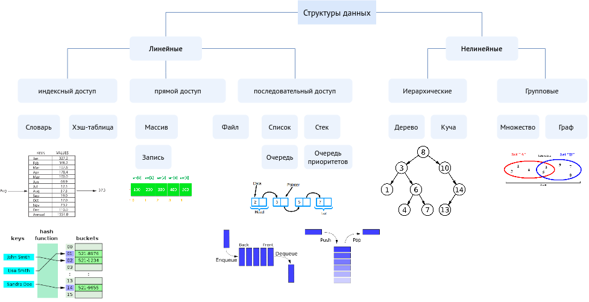

# Структуры и алгоритмы обработки данных

### [Очное 2023, Осень](current_plans/2023/2023_fall.md)
[Заочное, 2023-2024 Зима](current_plans/2023/readme.md)

# План
1. Абстрактный тип данных. Алгоритмы. Сложность алгоритмов, методы задания.
2. Алгоритмы поиска.
3. Алгоритмы сортировки данных.
4. Стек. Очередь. Очередь с приоритетом. Дек. Связанные списки.
5. Алгоритмы поиска подстроки в строке.
 

6. Деревья. Бинарные деревья. Бинарные деревья поиска. Алгоритмы обхода дерева.
7. Сбалансированные деревья. AVL – деревья. Красно-чёрные деревья. Splay – деревья. 2-3- деревья. В- деревья. Декартовы деревья.
8. Хеш-таблицы. Хеширование.
9. Графы. Алгоритмы на графах.
10. Словари.
11. NP-полные задачи.

# Ссылки
1. У. Топп, У. Форд. Структуры данных в С++: Пер. с англ. – М.: ЗАО «Издательство БИНОМ», – 816 с.
2. Ахо А.В. Структуры данных и алгоритмы / А.В. Ахо, Д. Хопкрофт, Д.Д. Ульман. – Москва: Вильямс, 2003. – 384с.: ил.
3. Narasimha Karumanchi. Data structures and algorithms made easy, 2010
4. https://academy.yandex.ru/handbook/algorithms

**Дополнительно**
- [Complexity_Cheatsheet.pdf](https://static1.squarespace.com/static/52b30f7ae4b067ba989438d4/t/5a7bb70724a69414063b96f4/1518057223974/Complexity+Cheatsheet.pdf)
- https://hackingcpp.com/cpp/cheat_sheets.html#hfold2a — обзор контейнеров C++
- Д. Кнут -  Искусство программирования
